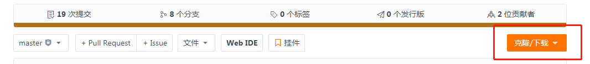

# **RCJava-core**
  [](https://jitpack.io/#com.gitee.BTAJL/RCJava-core)

***
### 目录

- [项目介绍](#cn-title-1)
- [目录结构](#cn-title-2)
- [安装教程](#cn-title-3)
- [使用说明](#cn-title-4)

***

<a name="cn-title-1"></a>

#### 项目介绍

1. Java SDK for RepChain，包括构造签名交易、提交签名交易、查询交易或块数据等链信息、同步块数据、订阅出块事件，及其他的一些工具类。<br>
2. 签名交易包括三种类型：1、部署合约类型的交易；2、调用合约类型的交易；3、修改合约状态类型的交易。<br>
3. 注册用户通过签名交易可以管理合约生命周期以及合约方法的权限

****

<a name="cn-title-2"></a>

#### 目录结构

- src/main目录下
    ```
    com
      └── rcjava
          ├── client
          ├── contract
          ├── exception
          ├── gm
          ├── protos
          ├── sign
          ├── sync
          ├── tran
          ├── util
          └── ws
    ```
    * **`com.rcjava.client`** 主要用来构造与RepChain交互的客户端，客户端可以用来提交签名交易、获取交易或块数据、订阅出块事件
    
    * **`com.rcjava.contract`** 主要用来构造与RepChain交互的客户端，客户端可以用来部署升级合约、修改合约状态、调用合约
    
    * **`com.rcjava.exception`** 自定义的一些异常
    
    * **`com.rcjava.gm`** 定义了GMProvider
    
    * **`com.rcjava.protos`** protoBuf generated messages
    
    * **`com.rcjava.sign`** 主要是加密相关的工具类，包括签名与Hash等
    
    * **`com.rcjava.tran`** 用来构建签名交易
    
    * **`com.rcjava.sync`** 用来同步区块数据
    
    * **`com.rcjava.tran`** 用来构建签名交易
    
    * **`com.rcjava.util`** 主要是封装了一些工具类<br>
    
        > - CertUtil   证书相关工具类
        > - GmUtil    国密相关工具类
        > - KeyUtil    key操作相关的工具类
        > - PemUtil  Pem操作相关的工具类
        
    * **`com.rcjava.ws`** 利用websocket订阅块事件
- src/test
    * 主要是签名给交易构造与提交、权限管理、区块同步和相关工具类等的测试用例，用户可参考此示例代码来构造交易、提交交易以及使用相关工具类
    

***

<a name="cn-title-3"></a>

#### 安装教程

1. 项目基于MAVEN构建，需搭建好MAVEN环境

   * 若使用命令行，到[官网下载](https://maven.apache.org/download.cgi)

     

   * 使用IDE（[idea](https://www.jetbrains.com/idea/download/#section=windows)/[eclipse](https://www.eclipse.org/downloads/)）插件

     > 如果maven官方镜像仓库比较慢，请在settings.xml或pom.xml中配置镜像

2. jdk1.8+

   > 推荐使用[Zulu-Jdk](https://cn.azul.com/downloads/zulu-community/?architecture=x86-64-bit&package=jdk)

3. 下载项目

   - 如果没有安装[Git](https://git-scm.com/downloads)环境，直接download项目到本地开发环境中
   - 如果安装有[Git](https://git-scm.com/downloads)，使用命令git clone，clone项目到本地开发环境中

4. `mvn clean install` 打包rcjava-core为jar包，并install到本地maven仓库

5. 其他项目就可以通过如下方式使用rcjava-core了

   > ```xml
   > <dependency>
   > 	<groupId>repchain</groupId>
   > 	<artifactId>rcjava-core</artifactId>
   > 	<version>2.0.1-SNAPSHOT</version>
   > </dependency>
   > ```

***

#### 使用JitPack安装

* step1：

  ```xml
  <repositories>
  	<repository>
  		<id>jitpack.io</id>
  		<url>https://jitpack.io</url>
  	</repository>
  </repositories>
  ```

* step2：

  ```xml
  <dependency>
  	<groupId>com.gitee.BTAJL</groupId>
  	<artifactId>RCJava-core</artifactId>
  	<version>2.0.1-SNAPSHOT</version>
  </dependency>
  ```

***

<a name="cn-title-4"></a>

#### 使用说明

* 搭建好RepChain
  
* 推荐使用`secp256r1`生成密钥对（当然也可以使用其他[curves](https://docs.oracle.com/en/java/javase/13/security/oracle-providers.html#GUID-091BF58C-82AB-4C9C-850F-1660824D5254)）
  
    > ```java
    > // 打印出Jdk可支持的曲线
    > // --add-exports=java.base/sun.security.util=ALL-UNNAMED
    > public static void printSunCurves() {
    >     Collection curves = CurveDB.getSupportedCurves();
    >     curves.forEach(System.out::println);
    > }
    > ```
  
* 注册账户证书

    * 向管理员（RepChain中的用户）申请注册账户和证书到RepChain，注册账户和证书的示例可参考`/src/test/java/com/rcjava/did/SignerOperationTest.java`

* 构建签名交易

  > <font color=#ff00><b>交易的签名算法根据对应RepChain版本进行设置</b></font>
  >
  > 1. `RepChain-V1.1.1`及之前版本使用`SHA1withECDSA`，之后使用`SHA256withECDSA`

  * 使用tran/impl下的具体类
    * InvokeTran

      ```java
      // 标识账户证书
      Peer.CertId certId = Peer.CertId.newBuilder()
                // 调用者账户号
          			.setCreditCode("identity-net:121000005l35120456")
                // 证书标识，对应于先前注册的证书名
          			.setCertName("node1")
          			.build(); // 签名ID
      
      // 这个是给转账交易示范用的，此ID需要与repchain合约部署的一致
      Peer.ChaincodeId contractAssetsId = Peer.ChaincodeId.newBuilder()
                // 合约名
          			.setChaincodeName("ContractAssetsTPL")
                // 合约版本号
          			.setVersion(1)
         				.build();
      Transfer transfer = new Transfer("identity-net:121000005l35120456", "identity-net:12110107bi45jh675g", 5);
      
      // 合约方法参数
      Peer.ChaincodeInput chaincodeInput = Peer.ChaincodeInput.newBuilder()
        							// 合约方法
                      .setFunction("transfer")
        							// 合约方法实参
                      .addArgs(JSON.toJSONString(transfer))
                      .build();
      
      InvokeTran invokeTran = InvokeTran.newBuilder()
          			      .setTxid("1234567890")
                      .setChaincodeInput(chaincodeInput)
                      .setCertId(certId)
                      .setChaincodeId(contractAssetsId)
                      .setPrivateKey(privateKey)
                      .setSignAlgorithm("SHA256withECDSA")
                      .build();
       Peer.Transaction transaction = invokeTran.getSignedTran();
       // 其他方式：
       // Peer.Transaction transaction_2 = invokeTran.getSignedTran(privateKey, "sha256withecdsa");
       // Peer.Transaction transaction_4 = RCTranSigner.getSignedTran(invokeTran, privateKey, "sha256withecdsa");
      ```
    
    * CidStateTran
    
      > 参考InvokeTran的构建
    
    * DeployTran
    
      > 参考InvokeTran的构建
    
  * 使用TranCreator构建具体的交易

    * 构建InvokeTran

      ```java
      // 标识账户证书
      Peer.CertId certId = Peer.CertId.newBuilder()
          			.setCreditCode("identity-net:121000005l35120456")
          			.setCertName("node1")
          			.build(); // 签名ID
      
      // 这个是给转账交易示范用的，此ID需要与repchain合约部署的一致
      Peer.ChaincodeId contractAssetsId = Peer.ChaincodeId.newBuilder()
          			.setChaincodeName("ContractAssetsTPL")
          			.setVersion(1)
         				.build();
      Transfer transfer = new Transfer("identity-net:121000005l35120456", "identity-net:12110107bi45jh675g", 5);
      // 合约方法参数
      Peer.ChaincodeInput chaincodeInput = Peer.ChaincodeInput.newBuilder()
                      .setFunction("transfer")
                      .addArgs(JSON.toJSONString(transfer))
                      .build();
      TranCreator tranCreator = TranCreator.newBuilder()
          			.setPrivateKey(privateKey)
          			.setSignAlgorithm("SHA256withECDSA")
          			.build();
      String tranId = "UUID";
      Peer.Transaction tran = tranCreator.createInvokeTran(tranId, certId, contractAssetsId, "transfer", JSON.toJSONString(transfer), 0, "");
      ```
      
    * CidStateTran
    
      > 参考InvokeTran的构建
    
    * DeployTran
    
      > 参考InvokeTran的构建

* 提交签名交易

  * 使用**同步**方式

    > 用来提交签名交易的客户端：TranPostClient 
    >
    > ```java
    > public JSONObject postSignedTran(String tranHexString) {/***/}
    > public JSONObject postSignedTran(Transaction tran) {/***/}
    > ```

    * 使用Hex字符串的方式

      ```java
      TranPostClient tranPostClient = new TranPostClient("localhost:9081");
      // -------------------------------
          /****构建签名交易 Transaction tran ****/
      // -------------------------------
      String tranHex = Hex.encodeHexString(tran.toByteArray());
      JSONObject res = tranPostClient.postSignedTran(tranHex);
      ```

    * 使用字节块提交

      ```java
      TranPostClient tranPostClient = new TranPostClient("localhost:9081");
      // -------------------------------
          /****构建签名交易 Transaction tran ****/
      // -------------------------------
      JSONObject res = tranPostClient.postSignedTran(tran);
      ```
      

    > 如果RepChain端开启了**https单向或双向认证**，则需要使用如下方式构建TranPostClient
    >
    > ```java
    > SSLContext sslContext = SSLContexts.custom()
    >             .loadTrustMaterial(new File("jks/jdk13/121000005l35120456.node1.jks"), "123".toCharArray(), new TrustSelfSignedStrategy())
    >             .loadKeyMaterial(new File("jks/jdk13/121000005l35120456.node1.jks"), "123".toCharArray(), "123".toCharArray())
    >             .build();
    > // sslContext可根据具体情况来针对性的构建
    > TranPostClient tranPostClient = new TranPostClient("localhost:9081", sslContext);
    > ```

  * 使用**异步**方式

    > 用来异步提交签名交易的客户端：TranPostAsyncClient
    >
    > ```java
    > public Future<HttpResponse> postSignedTran(String tranHexString) {/***/}
    > public Future<HttpResponse> postSignedTran(Transaction tran) {/***/}
    > ```

    * 使用<u>Hex字符串</u>的方式

      ```java
      TranPostAsyncClient tranPostClient = new TranPostAsyncClient("localhost:9081");
      // -------------------------------
          /****构建签名交易 Transaction tran ****/
      // -------------------------------
      String tranHex = Hex.encodeHexString(tran.toByteArray());
      Future<HttpResponse> responseFuture = tranPostClient.postSignedTran(tranHex);
      ```

    * 使用<u>字节块</u>提交

      ```java
      TranPostAsyncClient tranPostClient = new TranPostAsyncClient("localhost:9081");
      // -------------------------------
          /****构建签名交易 Transaction tran ****/
      // -------------------------------
      Future<HttpResponse> responseFuture = tranPostClient.postSignedTran(tran);
      ```

    * 从future中解析数据，默认超时时间20s

      > ```java
      > HttpResponse httpResponse = responseFuture.get(20, TimeUnit.SECONDS);
      > JSONObject result = TranPostAsyncClient.resolveHttpResponseFuture(responseFuture);
      > ```
      

    > 如果RepChain端开启了**https单向或双向认证**，则需要使用如下方式构建TranPostAsyncClient
    >
    > ```java
    > SSLContext sslContext = SSLContexts.custom()
    >             .loadTrustMaterial(new File("jks/jdk13/121000005l35120456.node1.jks"), "123".toCharArray(), new TrustSelfSignedStrategy())
    >             .loadKeyMaterial(new File("jks/jdk13/121000005l35120456.node1.jks"), "123".toCharArray(), "123".toCharArray())
    >             .build();
    > // sslContext可根据具体情况来针对性的构建
    > TranPostAsyncClient tranPostClient = new TranPostAsyncClient("localhost:9081", sslContext);
    > ```

* 使用ContractClient

  > 使用ContractClient部署升级合约、修改合约状态、调用合约，可选用具体方法，下面例子中的方法只是其中之一
  ```java
  CertId certId = CertId.newBuilder().setCreditCode("identity-net:121000005l35120456").setCertName("node1").build();
  // 这个是给转账交易示范用的，此ID需要与RepChain合约部署的一致
  ChaincodeId contractAssetsId = ChaincodeId.newBuilder().setChaincodeName("ContractAssetsTPL").setVersion(1).build();
  // privateKey是与certId标识的证书对应的用户私钥
  ContractUser user = new ContracUser(certId, privateKey);
  ContractClient contractClient = new ContractClient("localhost:9081", contractAssetsId, user);
  Transfer transfer = new Transfer("identity-net:121000005l35120456", "identity-net:12110107bi45jh675g", 5);
  contractClient.invokeContract("transfer", JSON.toJSONString(transfer));
  ```

  > 如果RepChain端开启了**https单向或双向认证**，则需要使用如下方式构建ContractClient
  >
  > ```java
  > SSLContext sslContext = SSLContexts.custom()
  >             .loadTrustMaterial(new File("jks/jdk13/121000005l35120456.node1.jks"), "123".toCharArray(), new TrustSelfSignedStrategy())
  >             .loadKeyMaterial(new File("jks/jdk13/121000005l35120456.node1.jks"), "123".toCharArray(), "123".toCharArray())
  >             .build();
  > ......
  > ContractClient client = new ContractClient(host, contractAssetsId, user, sslContext);
  > ```

* 查询交易数据

  > 使用ChainInfoClient构建查询客户端，用来获取链信息的客户端

  ```java
  ChainInfoClient chainInfoClient = new ChainInfoClient("localhost:9081");
  String txid = "1234567890";
  // 使用Json构建
  Transaction tran = chainInfoClient.getTranByTranId(txid);
  // 直接获取字节块构建
  Transaction tran = chainInfoClient.getTranStreamByTranId(txid);
  ```

  > 如果RepChain端开启了https单向或双向认证，则需要使用如下方式构建ChaininfoClient
  >
  > ```java
  > SSLContext sslContext = SSLContexts.custom()
  >             .loadTrustMaterial(new File("jks/jdk13/121000005l35120456.node1.jks"), "123".toCharArray(), new TrustSelfSignedStrategy())
  >             .loadKeyMaterial(new File("jks/jdk13/121000005l35120456.node1.jks"), "123".toCharArray(), "123".toCharArray())
  >             .build();
  > // sslContext可根据具体情况来针对性的构建
  > ChainInfoClient chainInfoClient = new ChainInfoClient("localhost:9081", sslContext);
  > ```

* 查询块数据

  > 使用ChainInfoClient构建查询客户端

  ```java
  ChainInfoClient chainInfoClient = new ChainInfoClient("localhost:9081");
  // 查询链信息
  BlockchainInfo blockchainInfo = chainInfoClient.getChainInfo();
  // 使用Json构建
  Block block = chainInfoClient.getBlockByHeight(5);
  // 直接获取字节块构建
  Block block = chainInfoClient.getBlockStreamByHeight(5)
  ```

* 查询其他数据

  > 使用ChainInfoClient构建查询客户端

  ```java
  ChainInfoClient chainInfoClient = new ChainInfoClient("localhost:9081");
  // 使用具体方法即可，如根据交易ID查询交易以及交易所在区块高度：
  ChainInfoClient.TranInfoAndHeight tranInfoAndHeight = chainInfoClient.getTranInfoAndHeightByTranId("1234567890");
  // 查询LevelDB
  Object leveldbRes = chainInfoClient.queryDB("identity-net", "ContractAssetsTPL", "", "121000005l35120456");
  // 查询交易入块后的结果
  TransactionResult tranRes = chainInfoClient.getTranResultByTranId("1234567890")
  ...
  ```

  > 如果RepChain端开启了**https单向或双向认证**，则需要使用如下方式构建ChainInfoClient
  >
  > ```java
  > ChainInfoClient chainInfoClient = new ChainInfoClient("localhost:9081", sslContext);
  > ```

* 同步块数据

  > 使用sync/SyncService构建同步服务，从**指定高度**开始同步，一直到**最新高度**，思路是：定时<拉>（基于http服务）和<推拉>结合（基于ws+http服务）的方式来同步区块，即订阅（基于ws/wss）与拉取（基于http/https）相结合的方案来保证区块同步的实时性，该方案可以防止相应节点<u>ws服务</u>崩溃，使用示例请参考SyncServiceTest
  >
  > 1. 使用host、syncInfo、syncListener（<u>实现该接口，可将区块存储到数据库中</u>）初始化
  > 2. 初始化之后，就可以启动同步服务
  > 3. SyncListener中，如果保存区块出现问题，要throw SyncBlockException

  ```java
  SyncInfo syncInfo = new SyncInfo(locHeight, locBlkHash);
  
  SyncService syncService = SyncService.newBuilder()
              .setHost("localhost:9081")
              .setSyncInfo(syncInfo)
              .setSyncListener("SyncListener实例")
              .build();
  Thread thread = new Thread(syncService::start);
  thread.start();
  ```

  > 如果RepChain端开启了**https单向或双向认证**，则需要使用如下方式构建SyncService
  >
  > ```java
  > SyncInfo syncInfo = new SyncInfo(locHeight, locBlkHash);
  > 
  > SyncService syncService = SyncService.newBuilder()
  >   					.setHost("localhost:9081")
  >             .setSyncInfo(syncInfo)
  >             .setSyncListener("SyncListener实例")
  >   		      .setSslContext(sslContext) // 此处需要设置sslContext
  >             .build();
  > ```

* 订阅块事件

  > 使用client/RSubClient构建客户端，使用观察者模式
  >
  > 1. 创建BlockObserver实例
  > 2. 创建BlockListener实例（可使用工具类BlockListenerUtil获取-->每个host只有唯一的1个listener）
  > 3. 向BlockListener中注册BlockObserver

  ```java
  // 获取block监听，使用 host 获取一个监听，每个 host 对应一个监听
  // 也可以自己去实例化
  blkListener = BlockListenerUtil.getListener(host);
  // event 监听，并回调给具体的实现类
  blkListener.registerBlkObserver("BlockObserver实例");
  RSubClient rSubClient = new RSubClient(host, blkListener);
  // 若RepChain开启了https单向或双向认证
  // RSubClient rSubClient = new RSubClient(host, blkListener, sslContext);
  rSubClient.connect();
  ```

* 解析区块的StateMap里的数据(指RepChain的proto文件中定义的结构数据，如Signer、Certificate、Operate、Authorize)需要用到`rc-proto.jar`(RepChain端proto-scala编译好的class)，可从本页面右侧"发行版"找到打包好的对应版本

  > 1. 从release中下载对应版本的`rc-proto.jar`
  >
  > 2. 将`rc-proto.jar`安装到本地maven库
  >
  >    ```shell
  >    mvn install:install-file -DgroupId=repchain -DartifactId=rc-proto -Dversion=2.0.0 -Dpackaging=jar -Dfile=rc-proto.jar
  >    ```
  >
  > 3. 在项目中引入依赖
  >
  >    ```java
  >    <dependency>
  >        <groupId>repchain</groupId>
  >        <artifactId>rc-proto</artifactId>
  >        <version>2.0.0</version>
  >    </dependency>
  >    ```
  >
  > 4. 通过`StateUtil`工具类来解析
  
* 国密的引入和使用

  > 1. 国密ssl包需要额外引入，暂时未开源
  >
  > 2. 具体使用示例可参考`src/test/java/com.rcjava.client.gm/TranPostGmClientTest`，`src/test/java/com.rcjava.client.gm/ChainInfoGmClientTest`
  
  * 国密ssl
  
    1. 继承`src/main/java/com.rcjava.gm.GMProvider`，或手动来安装Provider
  
        ```java
        Security.insertProviderAt((Provider) Class.forName("org.bouncycastle.jce.provider.BouncyCastleProvider").newInstance(), 1);
        Security.insertProviderAt((Provider) Class.forName("org.bouncycastle.jsse.provider.BouncyCastleJsseProvider").newInstance(), 2);
        ```
  
    2. 构建国密SSLContext
  
       ```java
       SSLContext sslContext = SSLContextBuilder.create()
               .setProtocol("GMSSLv1.1").setProvider("BCJSSE")
               .setKeyStoreType("PKCS12")
               .setKeyManagerFactoryAlgorithm("PKIX")
               .loadTrustMaterial(new File("pfx/mytruststore.pfx"), "changeme".toCharArray(), new TrustSelfSignedStrategy())
               .loadKeyMaterial(new File("pfx/215159697776981712.node1.pfx"), "123".toCharArray(), "123".toCharArray())
               .build();
       ```
  
    3. 构建交易提交客户端或查询客户端
  
       ```java
       TranPostClient tranPostClient = new TranPostClient("192.168.2.69:9081", sslContext);
       ChainInfoClient chainInfoClient = new ChainInfoClient("192.168.2.69:9081", sslContext);
       ```
  
  * 使用国密构造数字签名交易
  
    1. 与上面构造签名交易类似，只需要将签名算法改为"sm3withsm2"即可
  
       ```java
       TranCreator tranCreator = TranCreator.newBuilder().setPrivateKey(privateKey).setSignAlgorithm("SM3WITHSM2").build();
       ```
  
       

